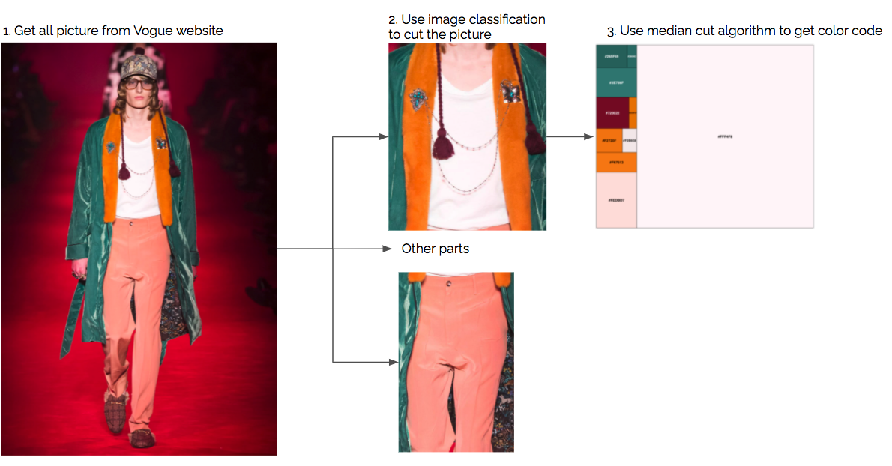

<br>
<center>
<a href="https://datawizart.com/"></a>
</center>
<style type="text/css">
h1.title {
  display:none;
}

h4.author { /* Header 4 - and the author and data headers use this too  */
    display: none;
}
h4.date { /* Header 4 - and the author and data headers use this too  */
   display: none;

}
</style>

<center><h1>Fashion Color Brand<br></h1></center> 
<br>
<center><p>By Dio Ariadi | [datawizart.com](https://datawizart.com/), August 2022</p></center>
<br>

```{r setup, , message=FALSE, warning=FALSE, echo=FALSE,fig.align='center'}
knitr::opts_chunk$set(echo = TRUE)

```


We looked at seven years of fashion show to find how each brand and each year changed their color theme.

Each year fashion designer for each brand will held their fashion show. They will show new design that can become as a new trend, it is usually followed by new color scheme as well. New design can be tricky to investigate but we can retrieve information for color scheme. We curious how each brand change their color scheme through the years. 

To investigate this we looked at the fashion show in the Vogue website

## How we gathering the data

Using Vogue website we pick some of the brand such as Prada, Chanel, Louis Vuitton, and Gucci. For each brands we took all picture from 2015 until 2021 and each season. After we collected all possible photos, we use image classification to get specific area for example top, shoes, skirt and etc, on this analysis we decided to use only top section. Further after we split the photos into multiple section we use median cut algorithm to retrieve color for that specific area. For this analysis we will only took 10 colors for each photos. 

Note: if you aware in the process to get the color code (hex code) it still contain skins color due to limitation in the image classification. Skins color or background color can also appeared in the hex code due to second step, with hope we still retrieve important information of the cloth.

<center></center>

## Presenting the data

From hex code we convert it into rgb format then we change it into [LAB](https://www.xrite.com/blog/lab-color-space) format. We change it into that so all colors can be presented using two dimensional graph.

<center></center>

After that we can start analyze and visualize all the data point. Where a and b stands for:

- **a**: Red/Green Value
- **b**: Blue/Yellow Value

```{r call library and data, message=FALSE, warning=FALSE, echo=FALSE}
library(tidyverse)
library(grDevices)
library(plotwidgets)
# library(crosstalk)
hsl_function <- function(color_hex,number){
  col2hsl(color_hex)[number]
}
df_analysis <- readRDS("df_analysis_2.rds")
```

```{r, echo=FALSE}
# df_analysis <- df_analysis %>% 
#   mutate(hue=map2_dbl(col_hex,1,hsl_function),
#          saturation = map2_dbl(col_hex,2,hsl_function),
#          lightness = map2_dbl(col_hex,3,hsl_function))
# 
background <- data.frame(seq_=seq(1:12),
           H=c(0,30,60,90,120,150,180,210,240,270,300,330),
           S=0.8,
           L=0.5) %>%
  pivot_longer(names_to = "label",values_to = "value",-seq_) %>%
  select(-label) %>% group_by(seq_) %>% nest() %>%
  mutate(colhex = map_chr(data,function(xx){hsl2col(as.matrix(xx))})) %>%
  unnest(data) %>%
  group_by(colhex) %>%
  mutate(row_ = row_number()) %>%
  filter(row_==1) %>% ungroup() %>% mutate(mboh=c(29,59,89,119,149,179,209,239,269,299,329,359))

# 
# df_analysis <- df_analysis %>% 
#   mutate(group_hue=cut(hue,c(-1,29,59,89,119,149,179,209,239,269,299,329,359.75)
#                        ,labels=c(0,1,2,3,4,5,6,7,8,9,10,11)*30
#                        ),
#          group_hue=(as.numeric(group_hue)-1)*30)
# df_analysis<-df_analysis %>% left_join(select(background,c("value","colhex")),by = c("group_hue"="value"))
# 
# df_analysis <- df_analysis %>% 
#   mutate(colhex= fct_reorder(colhex,-1*group_hue,min))

```

## Investigate how the color scheme change throught the years

Each dot represents the top 10 colors at a certain top. From here what is the most visible is how Chanel has a smaller area compared to others such as Gucci where this brand consistently has bold colors in its fashion. Second, we can see how the Louis Vuitton color scheme has changed over the years. After 2018 the colors will be brighter and bolder, this hypothesis will be confirmed using metric called saturation in the next section. 

```{r brand and year,fig.align='center',fig.height=10,fig.width=10, echo=FALSE}
df_analysis %>% 
  # filter() %>%
  ggplot(aes(x=a,y=b))+
  geom_point(aes(color=col_hex),shape=5,size=1)+
  facet_grid(brand~year_fix)+
  scale_color_identity()+
  theme_gray()+
  theme(panel.grid.minor = element_blank())
```


## Different between season


```{r brand and year split season,fig.align='center',fig.height=8,fig.width=10, echo=FALSE}
df_analysis %>% 
  # filter(type_of_season=="SPRING") %>%
  ggplot(aes(x=a,y=b))+
  geom_point(aes(color=col_hex),shape=5,size=1)+
  facet_grid(brand~year_fix+type_of_season)+
  scale_color_identity()
```

## Distribution of saturation (boldness) each year {.tabset}

Color saturation refers to the intensity of color in an image. As the saturation increases, the colors appear to be more pure. As the saturation decreases, the colors appear to be more washed-out or pale. Used this metric we can see that GUCCI has the highest saturation level compared to other. If we switched the graph into All season by year we can see that Louis Vuitton has increased their intensity in the last two years. While if we compared spring vs fall, except Prada all of the brand have a higher value in spring season.

### Overall by Brand

```{r, echo=FALSE,fig.align='center'}
df_analysis %>% 
  # filter(type_of_season=="SPRING") %>%
  ggplot(aes(x=brand,y=saturation,fill=brand,color=brand))+
  # geom_violin()+
  geom_boxplot(alpha=0.3)+
  # geom_point(aes(color=col_hex),shape=5,size=1)+
  # facet_grid(~brand)+
  scale_y_continuous(labels = scales::percent)+
  labs(x="Brand",y="Saturation")+
  theme(legend.position = "none")
  # scale_color_identity()
```

### All Season by year
```{r, echo=FALSE,fig.align='center'}
df_analysis %>% 
  # filter(type_of_season=="SPRING") %>%
  ggplot(aes(x=as.factor(year_fix),y=saturation,fill=brand,color=brand))+
  # geom_violin()+
  geom_boxplot(alpha=0.3)+
  # geom_point(aes(color=col_hex),shape=5,size=1)+
  facet_grid(~brand)+
  scale_y_continuous(labels = scales::percent)+
  labs(x="Year",y="Saturation")+
  theme(legend.position = "none",axis.text.x = element_text(angle = 90,vjust = .5))
  # scale_color_identity()
```


### Spring
```{r, echo=FALSE,fig.align='center'}
df_analysis %>% 
  filter(type_of_season=="SPRING") %>%
  ggplot(aes(x=as.factor(year_fix),y=saturation,fill=brand,color=brand))+
  # geom_violin()+
  geom_boxplot(alpha=0.3)+
  # geom_point(aes(color=col_hex),shape=5,size=1)+
  facet_grid(~brand)+
  scale_y_continuous(labels = scales::percent)+
  labs(x="Year",y="Saturation")+
  theme(legend.position = "none",axis.text.x = element_text(angle = 90,vjust = .5))
  # scale_color_identity()
```


### Fall
```{r, echo=FALSE,fig.align='center'}
df_analysis %>% 
  filter(type_of_season=="FALL") %>%
  ggplot(aes(x=as.factor(year_fix),y=saturation,fill=brand,color=brand))+
  # geom_violin()+
  geom_boxplot(alpha=0.3)+
  # geom_point(aes(color=col_hex),shape=5,size=1)+
  facet_grid(~brand)+
  scale_y_continuous(labels = scales::percent)+
  labs(x="Year",y="Saturation")+
  theme(legend.position = "none",axis.text.x = element_text(angle = 90,vjust = .5))
  # scale_color_identity()
```

### Spring vs Fall
```{r, echo=FALSE,fig.align='center'}
df_analysis %>% 
  # filter(type_of_season=="FALL") %>%
  ggplot(aes(x=type_of_season,y=saturation,fill=brand,color=brand))+
  # geom_violin()+
  geom_boxplot(alpha=0.3)+
  # geom_point(aes(color=col_hex),shape=5,size=1)+
  facet_grid(~brand)+
  scale_y_continuous(labels = scales::percent)+
  labs(x="Season",y="Saturation")+
  theme(legend.position = "none",axis.text.x = element_text(angle = 90,vjust = .5))
  # scale_color_identity()
```

## {-}

## Distribution of lightness between Spring and Fall

Using box-plot we can see the distribution between Spring and Fall. As we can see for all brand during spring, usually had brightness color than fall.

```{r lightness between spring and fall,fig.align='center', echo=FALSE}
df_analysis %>% 
  # filter(type_of_season=="SPRING") %>%
  ggplot(aes(x=type_of_season,y=lightness,fill=brand,color=brand))+
  # geom_violin()+
  geom_boxplot(alpha=0.3)+
  # geom_point(aes(color=col_hex),shape=5,size=1)+
  facet_grid(~brand)+
  scale_y_continuous(labels = scales::percent)+
  labs(x="Type of Season",y="Lightness")+
  theme(legend.position = "none")
  # scale_color_identity()
```


## Distribution of value for Hue between brand across the year {.tabset}

Hue can be defined as the property of light by which the color of an object is classified as red, blue, green, or yellow in reference to the spectrum.[source](https://www.dictionary.com/browse/the)

This box-plot and the line in the middle show the median value of hue each brand by year. We can assume that 50% of the color is around that hue level. For example Channel in 2015, the median color is yellowish, then in 2016 changed it into dark blue.


### All Season
```{r hue distribution,fig.align='center', echo=FALSE}

p1 <- ggplot()+
  geom_boxplot(aes(x=as.factor(year_fix),y=hue),position=position_dodge2(padding=0.2),alpha=0.6,data=df_analysis)+theme(legend.position = "bottom",legend.title = element_blank())+facet_wrap(~brand)
  
p1 +
  geom_tile(aes(y=value,x=7,fill=fct_reorder(colhex,seq_)),data=background)+
  geom_tile(aes(y=value,x=1,fill=fct_reorder(colhex,seq_)),data=background)+
  geom_tile(aes(y=value,x=2,fill=fct_reorder(colhex,seq_)),data=background)+
  geom_tile(aes(y=value,x=3,fill=fct_reorder(colhex,seq_)),data=background)+
  geom_tile(aes(y=value,x=4,fill=fct_reorder(colhex,seq_)),data=background)+
  geom_tile(aes(y=value,x=5,fill=fct_reorder(colhex,seq_)),data=background)+
  geom_tile(aes(y=value,x=6,fill=fct_reorder(colhex,seq_)),data=background)+
  geom_boxplot(aes(x=as.factor(year_fix),y=hue),position=position_dodge2(padding=0.2),alpha=0.9,data=df_analysis)+
  facet_wrap(~brand)+theme_minimal()+theme(legend.position = "none")+labs(x="Year",y="Hue")
  

# p1+p2
```


### Spring
```{r spring bp,fig.align='center', echo=FALSE}
bp_spring_1 <- ggplot()+
  geom_boxplot(aes(x=as.factor(year_fix),y=hue),position=position_dodge2(padding=0.2),alpha=0.6,data=dplyr::filter(df_analysis,type_of_season=="SPRING"))+theme(legend.position = "bottom",legend.title = element_blank())+facet_wrap(~brand)
  
bp_spring_1 +
  geom_tile(aes(y=value,x=7,fill=fct_reorder(colhex,seq_)),data=background)+
  geom_tile(aes(y=value,x=1,fill=fct_reorder(colhex,seq_)),data=background)+
  geom_tile(aes(y=value,x=2,fill=fct_reorder(colhex,seq_)),data=background)+
  geom_tile(aes(y=value,x=3,fill=fct_reorder(colhex,seq_)),data=background)+
  geom_tile(aes(y=value,x=4,fill=fct_reorder(colhex,seq_)),data=background)+
  geom_tile(aes(y=value,x=5,fill=fct_reorder(colhex,seq_)),data=background)+
  geom_tile(aes(y=value,x=6,fill=fct_reorder(colhex,seq_)),data=background)+
  geom_boxplot(aes(x=as.factor(year_fix),y=hue),position=position_dodge2(padding=0.2),alpha=0.9,data=dplyr::filter(df_analysis,type_of_season=="SPRING"))+
  facet_wrap(~brand)+theme_minimal()+theme(legend.position = "none")+labs(x="Year",y="Hue")
  
```

### Fall
```{r fall bp,fig.align='center', echo=FALSE}
bp_fall_1 <- ggplot()+
  geom_boxplot(aes(x=as.factor(year_fix),y=hue),position=position_dodge2(padding=0.2),alpha=0.6,data=dplyr::filter(df_analysis,type_of_season=="FALL"))+theme(legend.position = "bottom",legend.title = element_blank())+facet_wrap(~brand)
  
bp_fall_1 +
  geom_tile(aes(y=value,x=7,fill=fct_reorder(colhex,seq_)),data=background)+
  geom_tile(aes(y=value,x=1,fill=fct_reorder(colhex,seq_)),data=background)+
  geom_tile(aes(y=value,x=2,fill=fct_reorder(colhex,seq_)),data=background)+
  geom_tile(aes(y=value,x=3,fill=fct_reorder(colhex,seq_)),data=background)+
  geom_tile(aes(y=value,x=4,fill=fct_reorder(colhex,seq_)),data=background)+
  geom_tile(aes(y=value,x=5,fill=fct_reorder(colhex,seq_)),data=background)+
  geom_tile(aes(y=value,x=6,fill=fct_reorder(colhex,seq_)),data=background)+
  geom_boxplot(aes(x=as.factor(year_fix),y=hue),position=position_dodge2(padding=0.2),alpha=0.9,data=dplyr::filter(df_analysis,type_of_season=="FALL"))+
  facet_wrap(~brand)+theme_minimal()+theme(legend.position = "none")+labs(x="Year",y="Hue")
```

## {-}


## Conclusion

Color can be extracted and we can see the difference between brands and years. In this example we can see the most visible is how Chanel has a smaller range of color compared to others such as Gucci where this brand consistently has bold colors in its fashion. Also, we can see how the Louis Vuitton color scheme has changed over the years, where after 2018 the colors will be brighter and bolder. In term of saturation GUCCI has the highest saturation level compared to others, while for lightness usually spring is lighter compared to the fall season. The methodology itself can be improved if we can differentiate skin or backgrounds color more precisely.

That's it thank you for reading !!


<br>
<br>